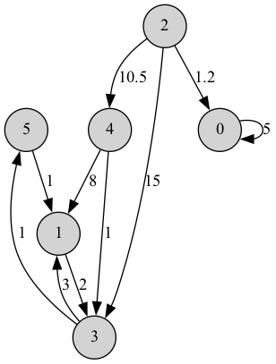
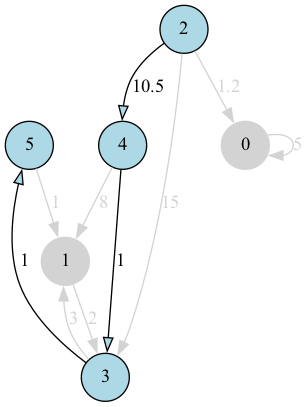

# Graph class and Dijkstra's algorithm

## О проекте

Проект на `C++`, в котором реализованы

1. Собственный класс графа со всеми необходимыми методами для взаимодействия с графом.
2. Алгоритм Дейкстры, для нахождения кратчайшего пути между двумя вершинами.
3. Визуализация алгоритма Дейкстры.

[//]: # (

)

**Технологии:** `С++`, `Google Tests`

## Визуализация

| Граф                                                            | Кратчайший путь                                                          |
|-----------------------------------------------------------------|--------------------------------------------------------------------------|
| 

 | 

 |

[//]: # (

)

## Контакты

Макс Кудряшов - [GitHub](https://github.com/kudrmax) - [Telegram](t.me/kudrmax)